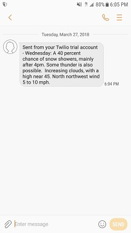

# SMS-Weather-Updates
Get weather updates texted to you when keywords are in the forecast

<b>Overview:</b> Uses Selenium to launch weather.gov and search for weather by zip code. A BeautifulSoup object is created for the loaded URL and the forecast for the week is extracted. A while loop and if statements are used to determine if "snow" or any other keywords of your choice are in the forecast. When the keyword is found, a text message is sent to the user. 
 
<b>Pre-requisites:</b>
<ul>
<li> Python v3.x </li>
<li> IDLE (or any other IDE of your choosing) </li>
<li> A free <a href="https://www.twilio.com/">Twilio account</a> for sending SMS messages </li>
</ul>
<b> Screenshots:</b>  

<b> Future Enhancements:</b> 
<ul>
<li> Schedule the script to run automatically with Windows Task Scheduler</li>
<li> Cleanup If statement code with Regular Expressions</li>
<li> Modify code to send an e-mail instead of text </li>
</ul>
